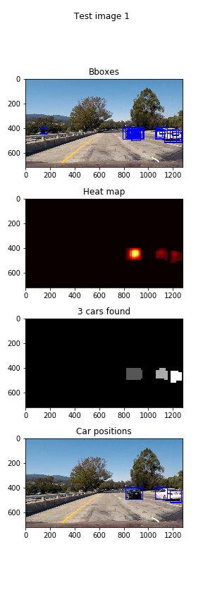
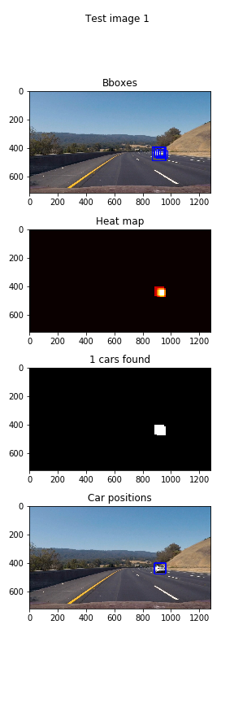
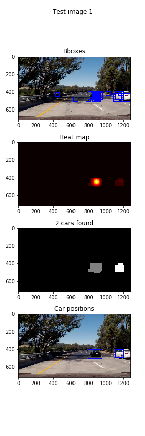
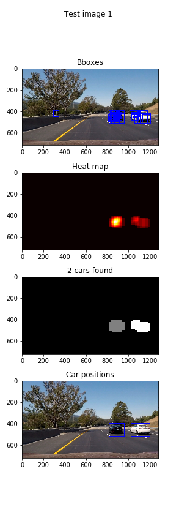

# **Vehicle Detection Project**
---

The goals / steps of this project are the following:

* Perform a Histogram of Oriented Gradients (HOG) feature extraction on a labeled training set of images and train a Linear SVM classifier
* Optionally, you can also apply a color transform and append binned color features, as well as histograms of color, to your HOG feature vector. 
* Note: for those first two steps don't forget to normalize your features and randomize a selection for training and testing.
* Implement a sliding-window technique and use your trained classifier to search for vehicles in images.
* Run your pipeline on a video stream (start with the test_video.mp4 and later implement on full project_video.mp4) and create a heat map of recurring detections frame by frame to reject outliers and follow detected vehicles.
* Estimate a bounding box for vehicles detected.

---

In the following discussion I will consider the [rubric points](https://review.udacity.com/#!/rubrics/513/view) individually and describe how I addressed each point in my implementation. The link to my GitHub repository can be found [here](https://github.com/urs-waldmann/CarND-Vehicle-Detection). 

---

## Features and Labels

The code for this step is contained in the Jupyter notebook `vehicle_detection.ipynb` in section *Load images* and *Features and labels*.

### Histogram of Oriented Gradients (HOG)

I started by reading in all the `vehicle` and `non-vehicle` images.  Here is an example of one of each of the `vehicle` and `non-vehicle` classes:


I then explored different color spaces and different `skimage.feature.hog()` parameters (`orient`, `pix_per_cell`, and `cell_per_block`).  I grabbed random images from each of the two classes and displayed them to get a feel for what the `skimage.feature.hog()` output looks like.

Here is an example using HOG parameters of `orient=9`, `pix_per_cell=(8, 8)` and `cell_per_block=(2, 2)`:


In addition to the histogram of orientated gradients I explored histograms of color and spatial binnings of color in order to use them as featurers for my classifier.

### Choice of parameters

I tried various combinations of parameters and chose the combination that gave me the best results training my classifier. My choice of parameters for the features mentioned above are the following:

| Parameter     | Value	        | 
|:-------------:|:-------------:| 
| Color space      | 'YCrCb'        | 
| HOG orientations      | 9        |
| HOG pixels per cell      | (8,8)      |
| HOG cells per block     | (2,2)      |
| HOG channel | "ALL" |
| Spatial binning dimensions | (8,8) |
| Number of histogram bins | 64 |

## Classifier

The code for this step is contained in the Jupyter notebook `vehicle_detection.ipynb` in section *Train classifier*.

I trained a linear SVM using `sklearn.svm.LinaerSVC()`. In order to get the best result for my classifier without exploring the best parameters manually I used `sklearn.model_selection.GridSearchCV()`. Since I am using a linear SVM I can only tune the parameter `C`. Using `sklearn.model_selection.GridSearchCV()` with
```python
parameters = {'C':[0.1, 1, 10]}
```
I obtained `C=0.1` being the best fit for my model with an accuracy of ```python 98.76%```.

## Sliding Window Search

The code for this step is contained in the Jupyter notebook `vehicle_detection.ipynb` in section *Search and classify test images*.

To implement a sliding window search I used the function `find_cars()` from the course material. This function can be found in the section *Helper functions* of my Jupyter notebook. This function basically searches a specified part of an image for cars. The area where to look for cars is restricted by the parameters `ystart` and `ystop`. The function searches an image for cars by sliding windows of the same shape over the specified area. Each sliding window extracts features and decides based on the extracted features whether there is a car or not in the sliding window. The overlap of the sliding windows is given by the parameter `scales`.
In oder to find the best values for the parameter `scales` I performed test runs with different values on the test images. I finally found the best values to be:
```python
parameters = [1.2, 1.5]
```
Therefore I searched on two scales using YCrCb 3-channel HOG features plus spatially binned color and histograms of color in the feature vector, which provided a nice result.
Furthermore I extended the function `find_cars()`. My edited function outputs the bounding boxes of the sliding window search for cars and the corresponding heat map. Thus I recorded the positions of positive detections in each image.  From the positive detections I created a heatmap.

In a next step I thresholded with:
```python
threshold = 2
```
that heat map to identify vehicle positions. I then used `scipy.ndimage.measurements.label()` to identify individual blobs in the heatmap.  I then assumed each blob corresponded to a vehicle. I constructed bounding boxes to cover the area of each blob detected to identify the position of each car.

Here are example results showing the bounding boxes of the sliding window search, the heatmap, the result of `scipy.ndimage.measurements.label()` and the bounding boxes then overlaid on all the images provided:

Test image 1:


Test image 2:


Test image 3:


Test image 4:


Test image 5:


Test image 6:


## Video Implementation

The code for this step is contained in the Jupyter notebook `vehicle_detection.ipynb` in section *Run on videos*.

I copied the pipeline for the single images into a function called `process_image()`. The code lines to edit and save the video clip is basically from the *Finding Lane Lines* project. I added the code in order to fit it to the current implementation.
Instead of using the project video I used my final project video from the *Advanced Lane Finding* project.
Here's a [link to my video result](./final_project_video.mp4). Enjoy!

## Discussion

As we can see in the final project video provided in the previous section, my pipeline works well on the project video. The bounding boxes are sometimes wabbly and there are really few false positives. In this section I want to adress some of the reasons. Please note that this list of troubleshooting points is not complete.

First of all the car images provided are almost all pictures taken from behind the car. Thus my classifier is biased towards the back of cars and does not recognize well e.g. the side of a car. In the project video however there are several frames where the white car appears on the side. That is the reason why sometimes the pipeline detects "two small cars", i.e. to small bounding boxes next to each other and not a single big one fitting the whole white car. By augmenting the 
Furthermore I only tried a linear SVM. Although I used `sklearn.model_selection.GridSearchCV()` to find the best parameter `C` I did not test other classifiers.
In addition the accuracy of my linear SVM varied between 98% and 100% and thus the result not stable. By choosing a better composition of a feature vector I could have stabilized the accuracy of my classifier.
Another problem was the sliding window serach. By using two scales on the whole image I got the cars in each frame. But to improve the wabbly bounding boxes and eliminate all false positives I should have used different scales together with different thresholds in different parts of the image. Regarding this problem instead of restricting the area of each frame where to search for cars only from `ystart` to `ystop` I should have restricted the area to a trapezoid fitting the lanes.

